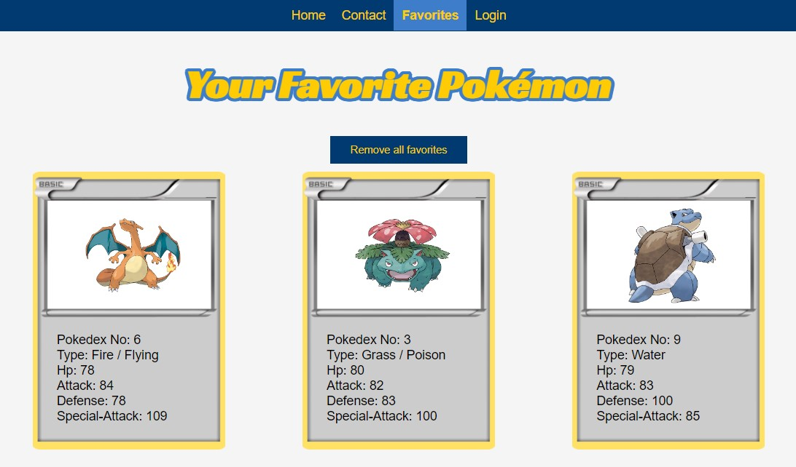

# JavaScript Frameworks CA



Create a website using an API of you choice combined with a login functionality using Wordpress JWT plugin.

## Description
This website is using the public pokemon API: [PokéAPI](https://pokeapi.co/)

### Some key features:
- Displays a list of the first 150 pokemon
- View details of any of the pokemon
- Add you favorite pokemon to a list using LocalStorage

## Built With
- React
- CSS

## Getting Started

### Installing

1. Clone the repo:

```bash
git clone git@github.com:KThomiss/pokemo-api.git
```

2. Install the dependencies:

```
npm install
```

### Running
To run the app, run the following commands:

```bash
npm start
```
